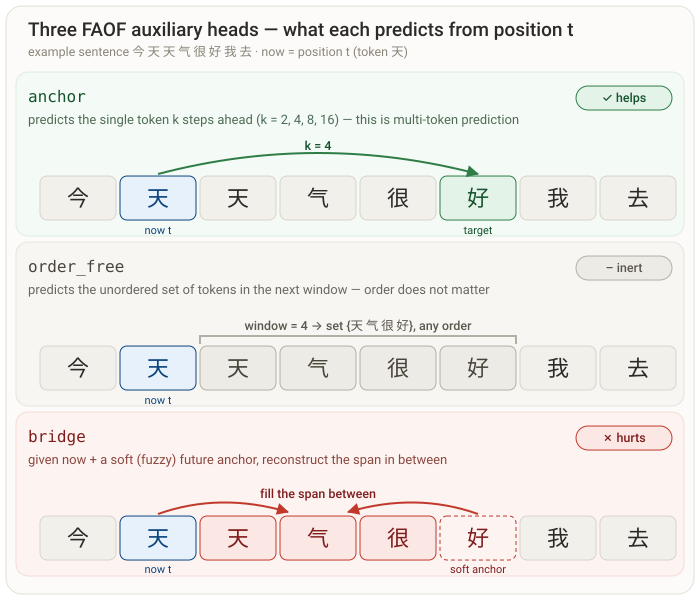

# FAOF-LM: Future-Anchored Order-Free Language Model

**English** | [中文](#中文文档)

Minimal training code for a small Chinese **Future-Anchored Order-Free** (FAOF) language model. The first implementation is intentionally **dense, not MoE**, so the core idea can be validated before adding routing complexity.

## What This Trains

The model is a causal decoder with auxiliary heads:

- **`next`**: standard next-token prediction.
- **`anchor`**: predicts future tokens at offsets `2, 4, 8, 16`.
- **`order_free`**: predicts the unordered *set* of tokens in a future window.
- **`bridge`**: uses the current hidden state plus soft future-anchor embeddings to reconstruct the span between the current position and a future anchor.



The default smoke config is tiny and only proves that the data, losses, and evaluation loop work. Use `configs/mvp_120m.json` as the starting point for a real 100M-scale run on a GPU machine.

## Results (probe-corrected)

Two multi-seed ablations — 18M params, 3 seeds, at 2000 steps / 13.8M tokens and
at 6000 steps / 51M tokens — evaluated with the **frozen-backbone probe** (see
[MVP Ablation](#mvp-ablation) for why `faof.eval` is invalid here) give a
consistent, scale-confirmed picture. Deltas below are the effect of turning each
loss on, at the 6000-step scale:

| loss added | next-token loss Δ (↓ better) | anchor probe `top5@8` Δ | order recall Δ | verdict |
| --- | ---: | ---: | ---: | --- |
| A → B  (anchor) | +0.006 | **+0.009** | **+0.009** | ✅ real gain, grows with scale |
| B → C  (order-free) | +0.000 | −0.000 | −0.000 | ⬜ inert |
| C → D  (bridge) | **+0.037** | +0.001 | +0.002 | ❌ hurts the LM for no probe gain |

**Takeaways:**

- The **anchor** head is the only auxiliary loss that improves the backbone, and
  its benefit *grows* with scale. It is essentially multi-token prediction.
- **order-free** is inert (B ≈ C on every metric); **bridge** degrades
  next-token loss for ~zero probe gain.
- **anchor-only (B) dominates the full bundle (D)** — the same representational
  gain at ~1/7 the next-token cost.

Honest status: FAOF's two novel components (order-free, bridge) do **not** yet
validate; the part that works (anchor) is prior art. These numbers are at 18M /
char-level Chinese — a benefit for order-free/bridge that only emerges at much
larger scale is not ruled out. Reproduce with
[`scripts/run_probe_ablation.py`](scripts/run_probe_ablation.py).

## Quick Smoke Test

```bash
uv sync
uv run python scripts/make_toy_corpus.py --out data/toy.txt --docs 4000
uv run python scripts/build_char_tokenizer.py --input data/toy.txt --out data/tokenizer.json --vocab-size 3000
uv run python scripts/tokenize_text.py --input data/toy.txt --tokenizer data/tokenizer.json --out-dir data/bin --val-ratio 0.02
uv run python -m faof.train --config configs/smoke.json
uv run python -m faof.eval --config configs/smoke.json --ckpt runs/smoke/ckpt_last.pt
```

## Interactive Generation

```bash
# ordinary autoregressive sampling
uv run python -m faof.chat --config <cfg.json> --ckpt <ckpt.pt> --mode next

# anchor-first FAOF sampling: bridge-decode toward a sampled future anchor
uv run python -m faof.chat --config <cfg.json> --ckpt <ckpt.pt> --mode faof --show-anchors
```

## Chinese Wiki Data

For the smallest real corpus, use Chinese Wikipedia plus a small amount of CLUECorpusSmall or another open Chinese corpus.

Recommended small recipe:

- 70% Chinese Wikipedia extracted plain text.
- 20% CLUECorpusSmall.
- 10% high-quality web sample such as Ultra-FineWeb zh.

Download the Chinese Wikipedia articles dump:

```bash
bash scripts/prepare_zhwiki.sh data/zhwiki
```

The script downloads `zhwiki-latest-pages-articles.xml.bz2`. Extract it with WikiExtractor or your preferred MediaWiki dump cleaner, then pass the resulting plain text to `scripts/build_char_tokenizer.py` and `scripts/tokenize_text.py`.

For a much smaller first real-data run, download only the first articles shard:

```bash
bash scripts/prepare_zhwiki_small.sh data/zhwiki_small
uv run python scripts/build_char_tokenizer.py --input data/zhwiki_small/zhwiki_small.txt --out data/zhwiki_small/tokenizer.json --vocab-size 8000 --max-lines 2000
uv run python scripts/tokenize_text.py --input data/zhwiki_small/zhwiki_small.txt --tokenizer data/zhwiki_small/tokenizer.json --out-dir data/zhwiki_small/bin --val-ratio 0.02 --max-lines 2000
uv run python -m faof.train --config configs/wiki_smoke.json
```

## MVP Ablation

Train the same base checkpoint with these loss weights:

| Run | `anchor_weight` | `order_free_weight` | `bridge_weight` |
| --- | ---: | ---: | ---: |
| A baseline | 0.0 | 0.0 | 0.0 |
| B anchor | 0.2 | 0.0 | 0.0 |
| C anchor+order | 0.2 | 0.1 | 0.0 |
| D anchor+order+bridge | 0.2 | 0.1 | 0.2 |

> **⚠️ Evaluate with the frozen-backbone probe, not `faof.eval`.**
> In configs A/B/C the anchor/order/bridge heads get zero loss weight, so they
> stay at random init. Comparing a *trained* head (D) against a *random* head
> (A) with `faof.eval` is meaningless — it exaggerates the effect by orders of
> magnitude (e.g. `anchor_top5@8`: A=0.0003 vs D=0.084, a fake 280× "win").
> The valid comparison freezes each trained backbone and trains a fresh,
> identical probe head, isolating representation quality. Use
> [`src/faof/probe.py`](src/faof/probe.py) and the multi-seed driver
> [`scripts/run_probe_ablation.py`](scripts/run_probe_ablation.py).

Success criteria (measured with the probe above, mean ± std over ≥3 seeds):

- Anchor `top5@8` / `top5@16` from a fresh probe on the FAOF backbone beat the
  same probe on the baseline backbone, by more than the seed-to-seed noise.
- Order-free recall and bridge accuracy add value *over anchor-only* (B), not
  just over the untrained baseline.
- Validation next-token loss does not degrade by more than about 3%.

```bash
# after training A/B/C/D, probe-compare them
uv run python scripts/run_probe_ablation.py \
  --base configs/wiki_full.json --steps 6000 --seeds 1337 2024 7 \
  --out runs/probe_ablation_full
```

Note: two probe-corrected sweeps (18M, 3 seeds — one at 2000 steps / 13.8M
tokens, one at 6000 steps / 51M tokens) agree, and the effect only sharpens with
scale:

- The **anchor** loss (config B) gives a real, growing representational gain —
  `anchor_top5@8` +0.009 (0.165→0.174) and `order_recall` +0.009 at 6000 steps —
  for a negligible next-token cost (~+0.006). It is essentially multi-token
  prediction, a known-good trick.
- **order-free** (C) is inert: B ≈ C on every metric, including `order_recall`
  itself.
- **bridge** (D) adds ~+0.037 to next-token loss for ~zero probe gain.

Net: **anchor-only (B) dominates the full bundle (D)** — same probe gains at a
seventh of the next-token cost. The two novel FAOF components (order-free,
bridge) do not pay off at these scales; ship B, or rethink C/D.

Generate and run a toy ablation:

```bash
uv run python scripts/make_ablation_configs.py \
  --base configs/smoke.json \
  --out-dir configs/ablation_smoke \
  --run-root runs/ablation_smoke \
  --max-steps 60

bash scripts/run_ablation.sh configs/ablation_smoke
```

## Cleaning WikiExtractor Output

If you extract the Wikipedia dump with WikiExtractor JSON output:

```bash
uv run python scripts/jsonl_text_extract.py \
  --input data/zhwiki/extracted \
  --out data/zhwiki/zhwiki.txt \
  --min-chars 80
```

You can then build a tiny mixed corpus:

```bash
uv run python scripts/mix_corpora.py \
  --source data/zhwiki/zhwiki.txt:0.7 \
  --source data/clue/clue.txt:0.2 \
  --source data/web/web_sample.txt:0.1 \
  --out data/mixed_zh_small.txt \
  --max-docs 100000
```

## License

[MIT](LICENSE)

---

# 中文文档

[English](#faof-lm-future-anchored-order-free-language-model) | **中文**

一个小型中文 **未来锚定·顺序无关**（Future-Anchored Order-Free，FAOF）语言模型的极简训练代码。第一版实现刻意采用 **dense 架构而非 MoE**，以便在引入路由复杂度之前先验证核心思想。

## 训练目标

模型是一个带辅助预测头的因果解码器：

- **`next`**：标准的下一 token 预测。
- **`anchor`**：预测偏移 `2, 4, 8, 16` 处的未来 token。
- **`order_free`**：预测未来窗口内 token 的无序*集合*。
- **`bridge`**：利用当前隐状态加上软未来锚点嵌入，重建当前位置与未来锚点之间的跨度。


默认 smoke 配置非常小，仅用于验证数据、损失和评估流程能跑通。在 GPU 机器上做真正的 1 亿参数级训练时，请以 `configs/mvp_120m.json` 为起点。

## 实验结论（探针校正）

两轮多种子消融 —— 18M 参数、3 seed，分别在 2000 步 / 1380 万 token 和
6000 步 / 5100 万 token —— 用**冻结骨干探针**评估（为什么 `faof.eval` 在这里无效，
见 [MVP 消融实验](#mvp-消融实验)），给出一致且随规模确认的结论。下表是逐个打开每种损失
的增量（6000 步规模）：

| 加入的损失 | next-token 损失 Δ（↓ 更好） | anchor 探针 `top5@8` Δ | order recall Δ | 判定 |
| --- | ---: | ---: | ---: | --- |
| A → B（anchor） | +0.006 | **+0.009** | **+0.009** | ✅ 真实增益，随规模放大 |
| B → C（order-free） | +0.000 | −0.000 | −0.000 | ⬜ 惰性 |
| C → D（bridge） | **+0.037** | +0.001 | +0.002 | ❌ 拖累主任务，探针零收益 |

**要点：**

- **anchor** 头是唯一能改善骨干的辅助损失，且增益**随规模增长**。它本质就是 multi-token
  prediction。
- **order-free** 惰性（B ≈ C 在每个指标上都成立）；**bridge** 拉高 next-token 损失、
  探针几乎零收益。
- **anchor-only（B）全面压制完整 bundle（D）** —— 同样的表示增益，只需约 1/7 的
  next-token 代价。

诚实结论：FAOF 的两个新颖组件（order-free、bridge）**尚未**得到验证；有效的部分（anchor）
是前人已有工作。这些数字是 18M / 中文字符级下测的 —— 不排除 order-free/bridge 在更大规模
才显现好处。复现见 [`scripts/run_probe_ablation.py`](scripts/run_probe_ablation.py)。

## 快速冒烟测试

```bash
uv sync
uv run python scripts/make_toy_corpus.py --out data/toy.txt --docs 4000
uv run python scripts/build_char_tokenizer.py --input data/toy.txt --out data/tokenizer.json --vocab-size 3000
uv run python scripts/tokenize_text.py --input data/toy.txt --tokenizer data/tokenizer.json --out-dir data/bin --val-ratio 0.02
uv run python -m faof.train --config configs/smoke.json
uv run python -m faof.eval --config configs/smoke.json --ckpt runs/smoke/ckpt_last.pt
```

## 交互式生成

```bash
# 普通自回归采样
uv run python -m faof.chat --config <cfg.json> --ckpt <ckpt.pt> --mode next

# 锚点优先的 FAOF 采样：向采样出的未来锚点做 bridge 解码
uv run python -m faof.chat --config <cfg.json> --ckpt <ckpt.pt> --mode faof --show-anchors
```

## 中文维基数据

最小可用真实语料建议使用中文维基百科，再混入少量 CLUECorpusSmall 或其他开放中文语料。

推荐的小配方：

- 70% 中文维基百科抽取的纯文本。
- 20% CLUECorpusSmall。
- 10% 高质量网络样本，例如 Ultra-FineWeb 中文。

下载中文维基百科条目 dump：

```bash
bash scripts/prepare_zhwiki.sh data/zhwiki
```

该脚本下载 `zhwiki-latest-pages-articles.xml.bz2`。用 WikiExtractor 或你惯用的 MediaWiki dump 清洗工具抽取后，将得到的纯文本传给 `scripts/build_char_tokenizer.py` 和 `scripts/tokenize_text.py`。

如果想先用更小的真实数据跑一轮，只下载第一个条目分片：

```bash
bash scripts/prepare_zhwiki_small.sh data/zhwiki_small
uv run python scripts/build_char_tokenizer.py --input data/zhwiki_small/zhwiki_small.txt --out data/zhwiki_small/tokenizer.json --vocab-size 8000 --max-lines 2000
uv run python scripts/tokenize_text.py --input data/zhwiki_small/zhwiki_small.txt --tokenizer data/zhwiki_small/tokenizer.json --out-dir data/zhwiki_small/bin --val-ratio 0.02 --max-lines 2000
uv run python -m faof.train --config configs/wiki_smoke.json
```

## MVP 消融实验

用同一基础 checkpoint、以下列损失权重分别训练：

| 实验 | `anchor_weight` | `order_free_weight` | `bridge_weight` |
| --- | ---: | ---: | ---: |
| A 基线 | 0.0 | 0.0 | 0.0 |
| B 锚点 | 0.2 | 0.0 | 0.0 |
| C 锚点+集合 | 0.2 | 0.1 | 0.0 |
| D 锚点+集合+桥接 | 0.2 | 0.1 | 0.2 |

> **⚠️ 用冻结骨干探针评估，不要用 `faof.eval`。**
> A/B/C 配置里 anchor/order/bridge 头的损失权重为 0，从头到尾停留在随机初始化。
> 用 `faof.eval` 拿*训练过*的头（D）去比*随机*头（A），毫无意义——会把效果夸大几个数量级
> （例如 `anchor_top5@8`：A=0.0003 对 D=0.084，虚假的 280 倍"提升"）。
> 正确做法是冻结每个训练好的骨干、训练一个全新且完全相同的探针头，只比较表示质量。
> 见 [`src/faof/probe.py`](src/faof/probe.py) 和多种子驱动脚本
> [`scripts/run_probe_ablation.py`](scripts/run_probe_ablation.py)。

成功标准（用上面的探针测量，≥3 个 seed 的均值 ± 标准差）：

- FAOF 骨干上的全新探针，其锚点 `top5@8` / `top5@16` 要超过同样探针在基线骨干上的结果，
  且差距大于种子间噪声。
- 顺序无关召回率和桥接准确率要相对 *anchor-only（B）* 有增益，而不只是赢过未训练的基线。
- 验证集下一 token 损失退化不超过约 3%。

```bash
# 训练完 A/B/C/D 后，用探针对比
uv run python scripts/run_probe_ablation.py \
  --base configs/wiki_full.json --steps 6000 --seeds 1337 2024 7 \
  --out runs/probe_ablation_full
```

注：两轮探针校正实验（18M、3 seed —— 一轮 2000 步 / 1380 万 token，一轮 6000 步 /
5100 万 token）结论一致，且规模越大越清晰：

- **anchor** 损失（配置 B）带来真实且随规模增长的表示增益 —— 6000 步下
  `anchor_top5@8` +0.009（0.165→0.174）、`order_recall` +0.009，而下一 token 代价
  可忽略（约 +0.006）。它本质就是 multi-token prediction，一个已知有效的技巧。
- **order-free**（C）完全惰性：B ≈ C 在每个指标上都成立，连 `order_recall` 本身也是。
- **bridge**（D）给下一 token 损失加了约 +0.037，探针上却几乎零收益。

结论：**anchor-only（B）全面压制完整 bundle（D）** —— 同样的探针增益，只需七分之一的
下一 token 代价。FAOF 的两个新颖组件（order-free、bridge）在这些规模下都不划算；
要么直接用 B，要么重新设计 C/D。

生成并运行一个玩具规模的消融实验：

```bash
uv run python scripts/make_ablation_configs.py \
  --base configs/smoke.json \
  --out-dir configs/ablation_smoke \
  --run-root runs/ablation_smoke \
  --max-steps 60

bash scripts/run_ablation.sh configs/ablation_smoke
```

## 清洗 WikiExtractor 输出

如果用 WikiExtractor 的 JSON 输出抽取维基 dump：

```bash
uv run python scripts/jsonl_text_extract.py \
  --input data/zhwiki/extracted \
  --out data/zhwiki/zhwiki.txt \
  --min-chars 80
```

然后可以构建一个小型混合语料：

```bash
uv run python scripts/mix_corpora.py \
  --source data/zhwiki/zhwiki.txt:0.7 \
  --source data/clue/clue.txt:0.2 \
  --source data/web/web_sample.txt:0.1 \
  --out data/mixed_zh_small.txt \
  --max-docs 100000
```

## 许可证

[MIT](LICENSE)
